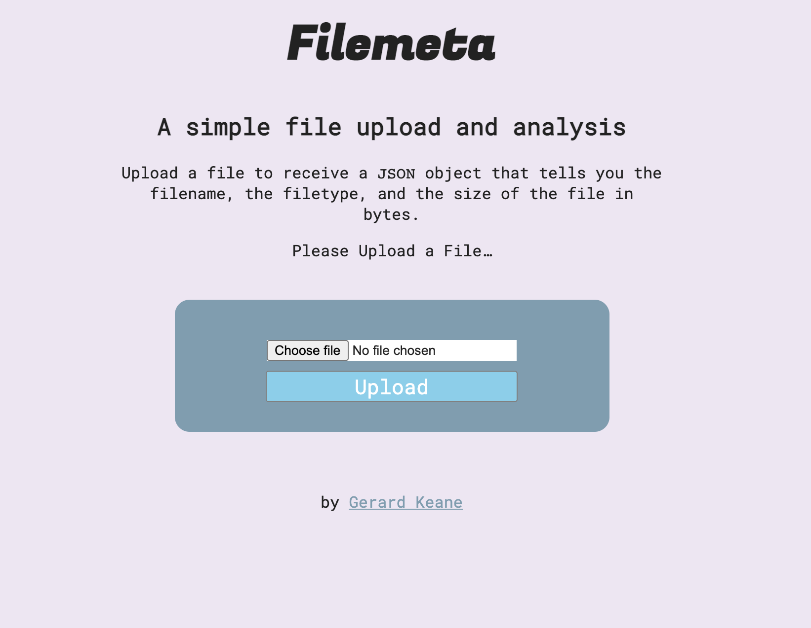

# Filemeta

A simple microservice to display some basic metadata about a supplied file. It will return a JSON object containing:

- The filename
- The filetype
- The size of the file in bytes

Uses [multer](https://www.npmjs.com/package/multer) for the file upload portion.

Created as part of the [FreeCodeCamp](https://www.freecodecamp.org) api and microservices challenge.